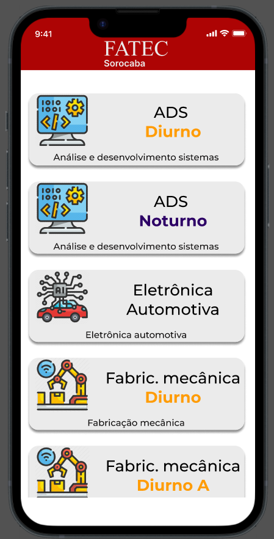

####         

###     ⚛️  

>  ​	 O bobjetivo desse projeto é desenvolver um app onde o alunx(não é um erro ortográfico) ou visitando possa se orientar sobre em qual **sala e/ou laboratório ** vai ter determinada **aula**  para determinado **curso**.
>
>   Exemplo:
>
>  -  **Analise e desenvolvimento de sistemas**
>    - Periodo: **Noturno**
>    - Matéria: **ENG. DE SOFT. I **
>    - Prédio 11- sala 06 
>  
>att,
>  
>**♕** **Genilson do Carmo**

####  

🔵 Abaixo algumas capturas de tela .

	📆 - 

 

 

 

              
