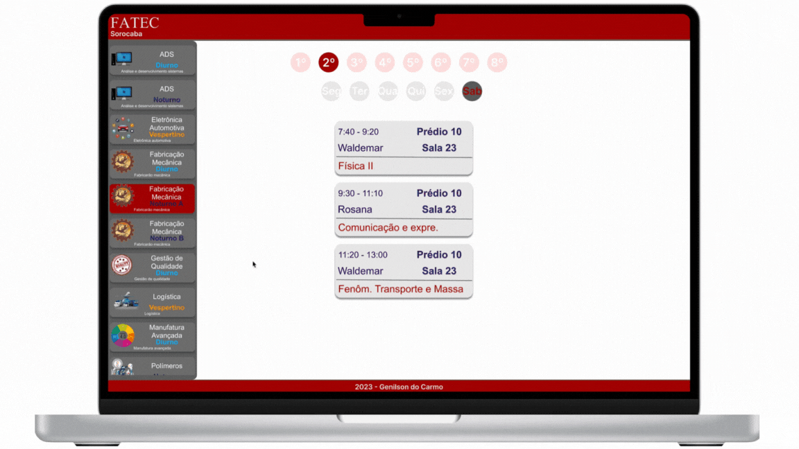

####         

          

 

###     ⚛️  

>  ​	 O bobjetivo desse projeto é desenvolver um app onde o alunx(não é um erro ortográfico) ou visitando possa se orientar sobre em qual **sala e/ou laboratório** vai ter determinada **aula**  para determinado **curso**.
>
>   att,
>
>  **♕** **Genilson do Carmo**

####  

 

 

 

              
