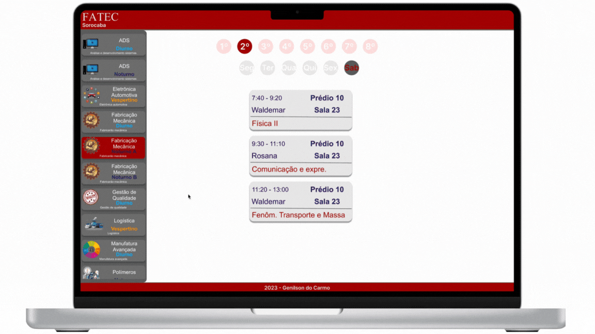

####   

### ⚛️

>  O **React** e o **React Native** são duas tecnologias populares desenvolvidas pelo Facebook (agora Meta Platforms, Inc.) para o desenvolvimento de interfaces de usuário web e móveis, respectivamente.
>
>  **React Características Principais**
>
>  - Componentização: React permite que os desenvolvedores dividam a interface de usuário em componentes reutilizáveis.
>  - Virtual DOM: O React utiliza um Virtual DOM para melhorar o desempenho e a eficiência das atualizações da interface.
>  - Unidirecional: O fluxo de dados no React é unidirecional, o que facilita o gerenciamento do estado da aplicação.
>
>  ### React Native
>
>  É um framework de desenvolvimento de aplicativos móveis que permite criar aplicativos nativos para iOS e Android usando JavaScript e React. Isso permite que os desenvolvedores compartilhem uma parte significativa do código entre as plataformas, economizando tempo e esforço.
>
>  ### **Características Principais**
>
>  - Desenvolvimento Cross-Platform: Com React Native, você pode criar aplicativos para iOS e Android a partir de um único código-base.
>  - Componentização: Da mesma forma que o React, o React Native promove a criação de componentes reutilizáveis.
>  - Acesso a Recursos Nativos: React Native permite que os desenvolvedores acessem recursos nativos do dispositivo por meio de módulos JavaScript.
>
>  att,
>
>  **♕** **Genilson do Carmo**

####

🔵 Abaixo algumas capturas de tela de aplicações, apps, serviços etc.

##  💻 WEB e 📱 Aplicativo

|                    |  |
| ------------------------------------------------------------ | ----------------------------------- |
|  |                                     |
|  |                                     |

##  

 
